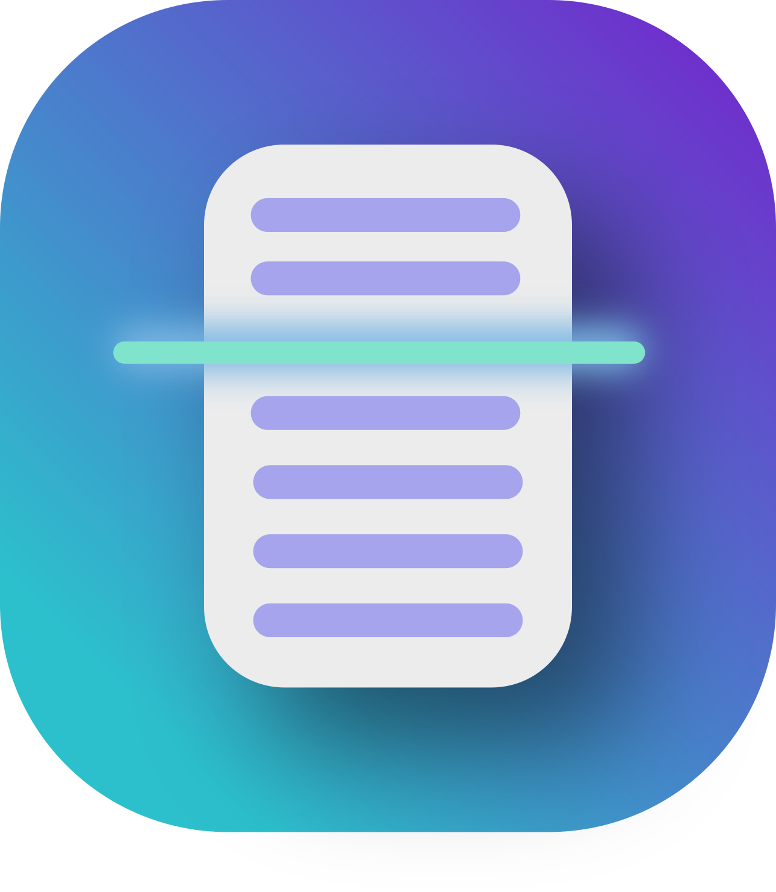

<p align="center">
  
</p>

## ScanBridge: An easy to use android app for scanning documents

<b>ScanBridge</b> is a Material You app featuring scanning of documents, photos, and more over the
AirScan/eSCL protocol. The eSCL protocol allows for driverless usage of network scanners and is
supported by most modern
scanners.

It is written in Kotlin and uses Jetpack Compose.

<div style="display: flex; flex-wrap: wrap; gap: 10px;">
  
  
  
</div>

## Features

- Discover scanners supporting eSCL in your network
- Scan multiple pages and arrange them however you like
- Use your scanner to the maximum of its capabilities by adjusting settings like input source,
  resolution, duplex scan, scanning dimensions, and more
- Save your scans as PDF or images & directly share them with other apps
- Nice-looking Material You design
- Easy-to-use interface

## Downloads

You can download the latest release APK from
the [releases page](https://github.com/Chrisimx/ScanBridge/releases).
Here you can also find a nightly build. You can also build the app yourself by following the
instructions below.

Alternatively, you can get it on F-Droid by clicking the button below:

[](https://f-droid.org/packages/io.github.chrisimx.scanbridge/)

## Permissions

eSCLKt only requires the internet permission to discover and use scanners in your network. No other
permissions are required.

## Dependencies

This project uses [eSCLKt](https://github.com/Chrisimx/eSCLKt), a Kotlin library for using
network-enabled
scanners supporting the eSCL/AirScan protocol.
Also, the [Jetpack Compose](https://developer.android.com/jetpack/compose) library is used for the
UI.
Additionally, the [Telephoto](https://github.com/saket/telephoto) library is used for making the
scanned pages preview
zoomable.
All other dependencies are listed in the build.gradle files.

## Building

Gradle is used as the build system. To build an APK, run the following command:

```./gradlew assembleRelease```

Afterwards, sign it with apksigner, which is provided by the Android SDK:

```apksigner sign --ks path/to/keystore.jks --out path/to/signed.apk path/to/unsigned.apk```

If you just want to build and test ScanBridge run the following command:

```./gradlew build```

## Bugs & feature requests

You can ask questions, report bugs or submit feature requests on the GitHub issue tracker. Please
provide a detailed
description of the problem and if possible, a crash log, android logcats or stacktraces. In some
cases
the ScannerCapabilities.xml of your scanner can also be useful

## Other communication channels

If you want to chat with me or other users, you can join the Matrix room
[#scanbridge:fireamp.eu](https://matrix.to/#/#scanbridge:fireamp.eu) or DM me on Matrix
(@chris.imx.dev:fireamp.eu).

## Contributions

Contributions are welcome, and it would be amazing if you want to help. Refer to
the [Contribution Guidelines](CONTRIBUTING.md) for more information.

## License

Copyright (C) 2024 Christian Nagel and contributors.

ScanBridge is free software: you can redistribute it and/or modify it under the terms of
the GNU General Public License as published by the Free Software Foundation, either
version 3 of the License, or (at your option) any later version.

ScanBridge is distributed in the hope that it will be useful, but WITHOUT ANY
WARRANTY; without even the implied warranty of MERCHANTABILITY or FITNESS
FOR A PARTICULAR PURPOSE. See the GNU General Public License for more details.

You should have received a copy of the GNU General Public License along with ScanBridge.
If not, see <https://www.gnu.org/licenses/>.

SPDX-License-Identifier: GPL-3.0-or-later

The icons (except for the app icon) used in the app are from the Material Design Icons library and
are licensed under the Apache License 2.0.
